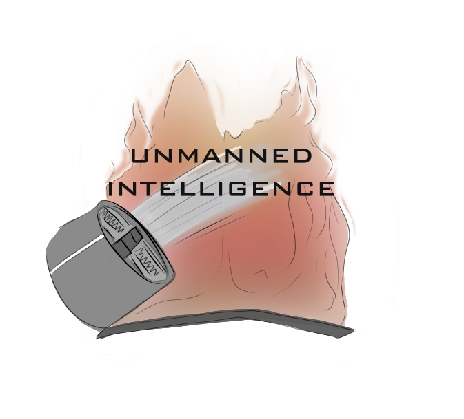
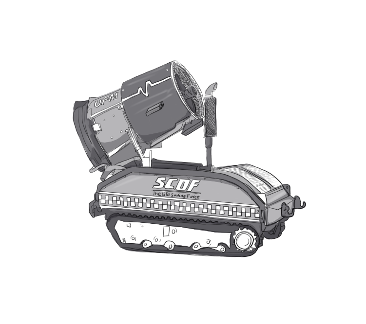
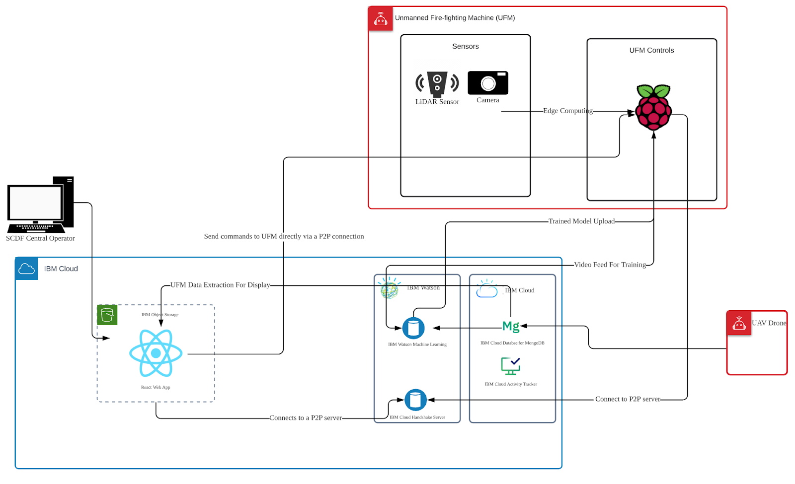
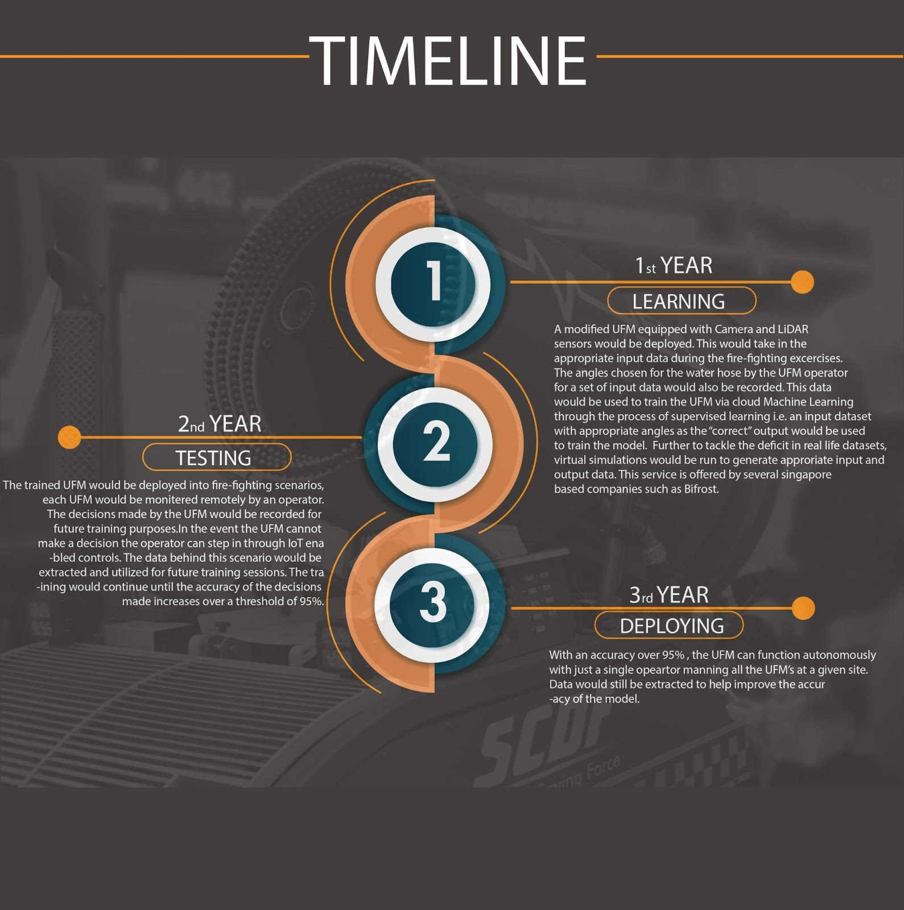
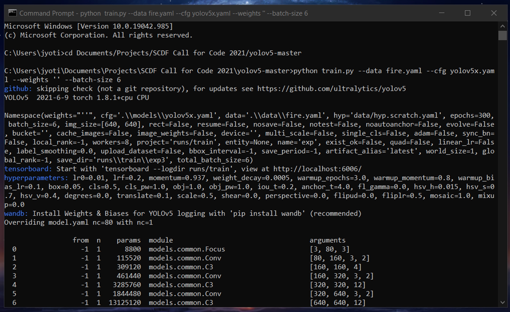
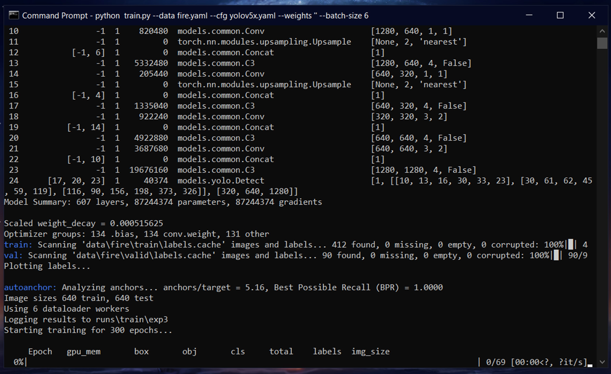
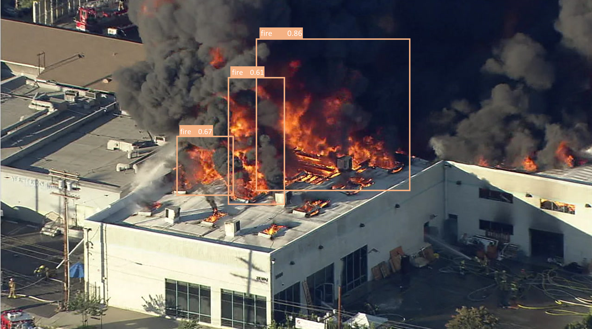
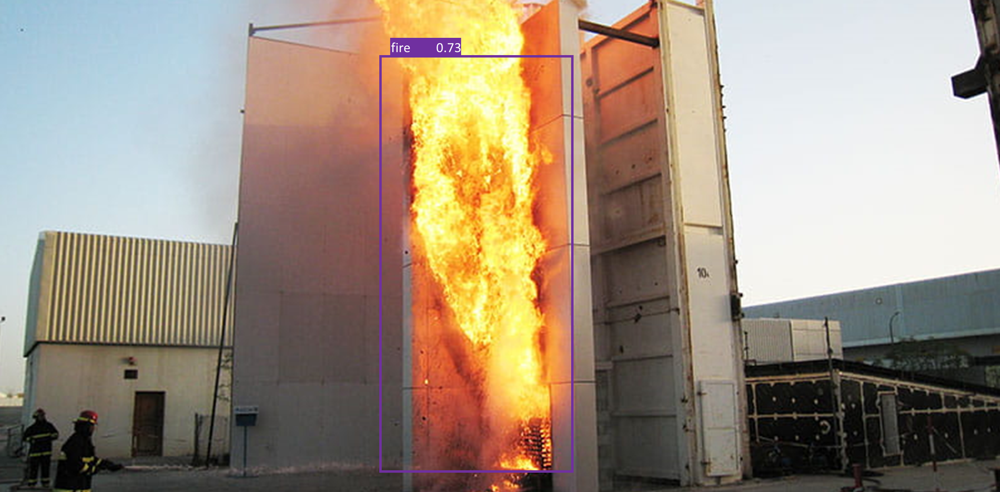

# FireBusters-UnmannedIntelligence_SCDFXIBM



ages.githubusercontent.com/62633038/121624491-36eed080-caa4-11eb-9b5d-282a42705a74.png">

Firefighters are not immune to the trends of Covid-19. Covid has created significant impediments to firefighting operations as well. Social distancing and mask wearing isn't really compatible with operations that need maxiumum efficiency to save lives. It's not possible to remain 1 m apart when lives are at stake.

@@ -16,21 +16,19 @@ Controlled from a dashboard, these machines are able to fight the fire by themse
#### Syed Mohammed Mosayeeb Al-Hady Zaheen
An NTU Data Science and AI freshie
#### Hoe Jun Leong
An NTU Year 2 Computer Engineering Student
#### Jyotit Kaushal
Freshmore from SUTD with a passion for Machine Learning and AI
#### Lee Jun Jie
Computer Engineering Graduate currently serving in SCDF
#### Visshal Natarajan
Freshmore from SUTD with a passion for ideas worth pursuing

## Unmanned Intelligence in a gist
## Unmanned Intelligance in a gist

In fire emergency situations that demand urgent action, any delay can mean loss of life and property. The restrictions brought about by COVID-19 onto physically deployed firefighters such as social distancing and even mask-wearing can cause inefficiencies which may hinder their response. In urgent situations firefighters may be forced to forsake some of these measures, which may exacerbate the spread of the virus.

Our idea is to reduce the need for physically deployed manpower to fire emergency situations by repurposing the SCDF Unmanned Firefighting Machine (UFM) to be deployed to fight the fire instead of humans. Through integration with AI and IoT technology and a synergestic combination with geospatial data gathered from the SCDF Unmanned Aerial Vehicle (UAV) (which is a drone that is employed by SCDF to get a bird's eye view of the incident), the UFM can be repurposed to be fully autonomous (with a human master) in fighting the fire without human control.



#### How it will work in a real fire - step by step

1. When there is a fire call, HQ will deploy the modified UFM to the location.
@@ -41,37 +39,18 @@ Our idea is to reduce the need for physically deployed manpower to fire emergenc
## Our Pitch Video

With so many cogs and gears in our project, it was of utmost importance to create a pitch video that is able to capture the core of our project both technically as well as our various thought-processes throughout the length of this Hackathon. That said, here's our pitch video for the project **Unmanned Intelligence** on Youtube.
https://youtu.be/kcHfiDdwXgI

## The Unmanned Intelligence Architecture with Detailed Solution

[Detailed Solution](https://docs.google.com/document/d/159HvT_roS5KOp-HkLzXx1kPh5p2cpTCU60tFzk6mu-A/edit?ts=60bdf66d#)



*https://docs.google.com/document/d/159HvT_roS5KOp-HkLzXx1kPh5p2cpTCU60tFzk6mu-A/edit?ts=60bdf66d#*

## A Proposed Timeline



## Live demo of dashboard

#### Live online demo - no installation required!

[Link to live demo](https://zaheensbucket1.s3.ap-southeast-1.amazonaws.com/SCDF-IBM-Challenge/build/index.html)

#### Run it locally 

Step 1: Install NPM from https://www.npmjs.com/get-npm

Step 2: Clone the directory "frontend" from this repository and go into the command line 

Step 3:

```bash
npm install
npm start
```
The local server should start on port 3000

## Requirements and Install

One of the major parts of our solution involves training and thereby dealing with a neural network. This means that for running our program on one's own computer and/or server would require one to install a number of essentiall packages and/or libraries like `pytorch`, `tensorboard`, `argparse`, `logging`, etc. There however, is no need to proactively fret over these dependencies since our code should automatically list everything uninstalled upon running. They can then be installed using the terminal window using the following command on both Windows and MacOS:
@@ -81,48 +60,26 @@ pip install PackageName

## Training the AI

The workflow that goes into creating an object detection model (in our case a fire) is one that's two-fold. While one part involves making our machine/network aware of what the object we want actually looks like and how it may detect it. The second involves actually exporting an image or a video into our network and then running the pre-trained model on the same.
The workflow that goes into creating an object detection model (in our case a fire) is one that can be considered two-fold. While one part involves making our machine/network aware of what the object we want actually looks like and how it may detect it. The second involves actually exporting an image or a video into our network and then running the pre-trained model on the same.

For our project, we use the YoloV5 object-detection model, acclaimated for its ease of use to do a custom train as well as its customization abilities that allows one to carefully tune the various parameters of the model as and when required.

Our whole procedure including the training and then deploying our AI model using IBM Watson Studio can be easily categorized into some key steps. The first involves sorting out all the pre-requisites required for the project and this involves setting up the required environment in an IDE, installing all the required packages, etc; collecting the dataset(s) required to train our model; setting up the directories in an appropriate order; configuring the YAML files (something that's especially crucial when using yolov5), etc.

In order to set up a working environment for our model, you can simply clone the Yolov5 repository, by running the following command in the terminal:
```bash
!git clone https://github.com/ultralytics/yolov5 
```
This step is then followed by installing Torch using the *pip install* command shown before to finish setting up our environment. 

The datset would be cloned with the cloned repository but one can easily run the model with any dataset of their choosing. Upon confirming everything is in order, we configure our YAMLs (again already done in this case) to specify your training data, validation data, etc.

We then go on to deploy the model using a service like IBM Watson Studio; AWS Machine Learning, etc. or by simply using the following command in your terminal to run the `python.py` file. 
```bash
python train.py --data fire.yaml --cfg yolov5x.yaml --weights '' --batch-size 6
```
For our project we were unable to train this model due to its high complexity to ensure the utmost amount of accuracy but here's a snippet of what your terminal should be looking like when it begins to start training:
 

This deployment can be further customized based on the accuracy required and/or time available to train the model.
We then go on to deploy the model using a service like IBM Watson Studio; AWS Machine Learning, etc. using the `train.py`. This deployment can be further customized based on the accuracy required and/or time available to train the model.
This rather time-consuming step is then followed by the actual detection of the set object (i.e. fire) by using `detect.py` on an unseen image exported into our model and/or streamed live.

Upon succesful training and then deployment of our model, we are now capable of detecting a fire or several fires in real-time from an unseen footage (as shown below) and/or camera captured using the camera on-board the UMF, and hence fulfilling a crucial part of our solution.
## Results

 

Upon succesful training and then deployment of our model, we are now capable of detecting a fire or several fires in real-time from an unseen footage and/or camera captured using the camera on-board the UMF, allowing the operators to fight the fire remotely and much more efficiently. 
## Impact 
The automation of UFM's would enable SCDF to reduce the number of professional fire-fighters on the site of fire, thereby minimising the risk of injury. Further, it would help overcome the manpower shortage created due to the unavailability of trained NS Men (COVID-restrictions), thereby enabling SCDF to operate more efficiently by leveraging existing technology. Additionaly, in the long run the automation of UFM's would be in alignmnent with the agenda of making Singapore a smart nation. The 

## Conclusion

## Softwares Employed for the Solution

- IBM Watson Studio
- ROS
- IBM Cloud

- Amazon S3 Storage
- React Web Application
## Credits
-https://github.com/nationaldronesau/FlirImageExtractor
-https://www.ibm.com/cloud/learn/vmware?utm_medium=OSocial&utm_source=Youtube&utm_content=000005UJ&utm_term=10002434&utm_id=YTDescription-301-Intro-to-VMware-Solutions-LH--VMware-Guide&cm_mmc=OSocial_Youtube-_-Cloud+and+Data+Platform_Cloud+Platform+F2F-_-WW_WW-_-YTDescription-301-Intro-to-VMware-Solutions-LH-VMware--Guide&cm_mmca1=000005UJ&cm_mmca2=10002434
-https://towardsdatascience.com/yolo-v5-object-detection-tutorial-2e607b9013ef
-https://guides.github.com/features/mastering-markdown/
-https://github.com/ai-coodinator/xml_to_textYolo
-https://github.com/ultralytics/yolov5
-https://towardsdatascience.com/early-fire-detection-system-using-deep-learning-and-opencv-6cb60260d54a
