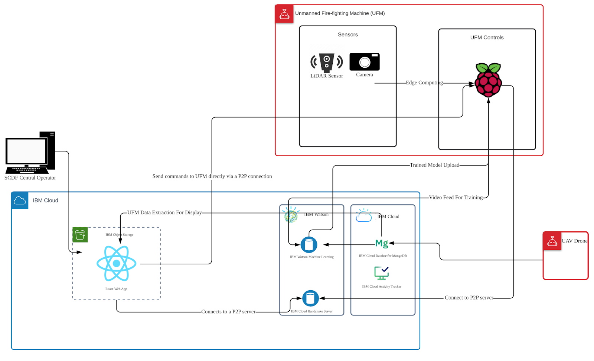
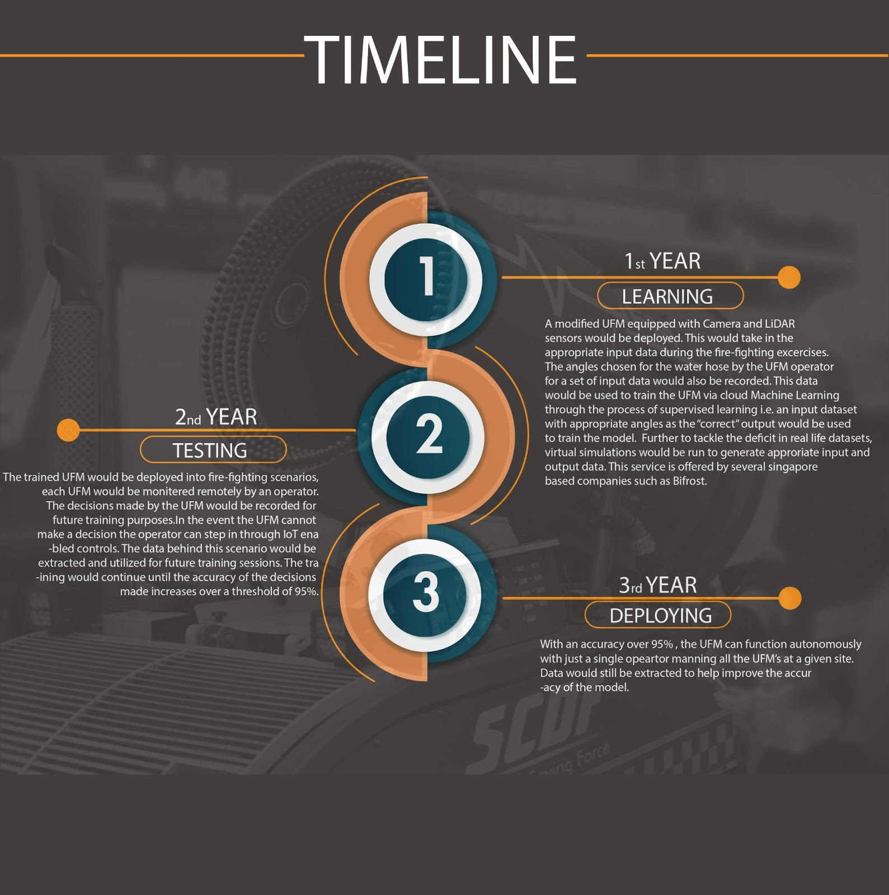

# FireBusters-UnmannedIntelligence_SCDFXIBM

With the pandemic in 2020 bringing about a shortage in the available man-force in a majority of the sectors of various industries, our solution uses the power of AI i.e., Unmanned Intelligence to help SCDF in its functions of dealing with fires all around the island by the use of AI and IoT to modify the existing UFM- allowing it to be controlled remotely with a 5:1 man to machine ratio.

## Our Team: The FireBusters

#### Syed Mohammed Mosayeeb Al-Hady Zaheen
#### Hoe Jun Leong
#### Jyotit Kaushal
#### Lee Jun Jie
#### Visshal Natarajan

## Unmanned Intelligance in a gist

In fire emergency situations that demand urgent action, any delay can mean loss of life and property. The restrictions brought about by COVID-19 onto physically deployed firefighters such as social distancing and even mask-wearing can cause inefficiencies which may hinder their response. In urgent situations firefighters may be forced to forsake some of these measures, which may exacerbate the spread of the virus.

Our idea is to reduce the need for physically deployed manpower to fire emergency situations by repurposing the SCDF Unmanned Firefighting Machine (UFM) to be deployed to fight the fire instead of humans. Through integration with AI and IoT technology and a synergestic combination with from the SCDF Unmanned Aerial Vehicle (UAV), the UFM can be repurposed to be fully autonomous (with a human master) in fighting the fire without human control.

## Our Pitch Video

With so many cogs and gears in our project, it was of utmost importance to create a pitch video that is able to capture the core of our project both technically as well as our various thought-processes throughout the length of this Hackathon. That said, here's our pitch video for the project **Unmanned Intelligence** on Youtube.

## The Unmanned Intelligence Architecture with Detailed Solution



*https://docs.google.com/document/d/159HvT_roS5KOp-HkLzXx1kPh5p2cpTCU60tFzk6mu-A/edit?ts=60bdf66d#*

## A Proposed Timeline



## Requirements and Install

One of the major parts of our solution involves training and thereby dealing with a neural network. This means that for running our program on one's own computer and/or server would require one to install a number of essentiall packages and/or libraries like `pytorch`, `tensorboard`, `argparse`, `logging`, etc. There however, is no need to proactively fret over these dependencies since our code should automatically list everything uninstalled upon running. They can then be installed using the terminal window using the following command on both Windows and MacOS:
```bash
pip install PackageName
```

## Training the AI

The workflow that goes into creating an object detection model (in our case a fire) is one that can be considered two-fold. While one part involves making our machine/network aware of what the object we want actually looks like and how it may detect it. The second involves actually exporting an image or a video into our network and then running the pre-trained model on the same.

For our project, we use the YoloV5 object-detection model, acclaimated for its ease of use to do a custom train as well as its customization abilities that allows one to carefully tune the various parameters of the model as and when required.

Our whole procedure including the training and then deploying our AI model using IBM Watson Studio can be easily categorized into some key steps. The first involves sorting out all the pre-requisites required for the project and this involves setting up the required environment in an IDE, installing all the required packages, etc; collecting the dataset(s) required to train our model; setting up the directories in an appropriate order; configuring the YAML files (something that's especially crucial when using yolov5), etc.
We then go on to deploy the model using a service like IBM Watson Studio; AWS Machine Learning, etc. using the `train.py`. This deployment can be further customized based on the accuracy required and/or time available to train the model.
This rather time-consuming step is then followed by the actual detection of the set object (i.e. fire) by using `detect.py` on an unseen image exported into our model and/or streamed live.

## Results

Upon succesful training and then deployment of our model, we are now capable of detecting a fire or several fires in real-time from an unseen footage and/or camera captured using the camera on-board the UMF, allowing the operators to fight the fire remotely and much more efficiently. 

## Softwares Employed for the Solution

- IBM Watson Studio
- ROS
- IBM Cloud

## Credits
